# SplitMoE

## The intuition

Sparse Mixture-of-Experts models store several independent feed-forward experts in a layer but route each token through only a few of them. This creates conditional capacity, but it also raises a simple question: **are the experts wasting parameters by independently relearning transformations that every expert needs?**

Suppose a layer has `N` experts. Instead of treating expert `i` as an unrelated function, we hypothesize that it can be decomposed into a common component and a specialization:

$$
E_i(x) = S(x) + P_i(x).
$$

Here, $S$ is shared by every expert in the layer and $P_i$ is private to expert $i$. For normalized routing weights, this gives:

$$
\sum_i p_i(x)E_i(x) = S(x) + \sum_i p_i(x)P_i(x).
$$

The common computation now needs to be stored and evaluated only once. The router's job also changes subtly: it chooses the specialization needed **after common capacity has already been provided**.

This repository tests that idea with a controlled SplitMoE layer:

$$
F_{\mathrm{split}}(x) = \alpha\left(S(x) + P_{i^{\ast}}(x)\right), \qquad i^{\ast}=\mathop{\mathrm{arg\,max}}_i p_i(x).
$$

Rather than adding a full shared expert on top of a normal MoE, SplitMoE divides the same active FFN width between a shared branch and one routed private branch. The output multiplier $\alpha$ is an optimization choice, not part of the sharing hypothesis; the confirmatory experiment tests both $\alpha=1$ and $\alpha=1/\sqrt{2}$. This lets us ask a precise question:

> At matched activated capacity, can a shared/private MoE retain the quality of a conventional Top-1 MoE while storing fewer parameters?

## Result in one sentence

**In a batch-matched, three-seed Top-1 experiment, Split-25 uses 16.4% fewer total parameters at equal activated capacity and beats Standard at both tested output scales; under 16-expert Top-4 routing, however, a conventional full shared expert achieves the best quality, so the preferred shared/private allocation depends on the routing regime.**

This is a positive parameter-efficiency result, not proof that the shared path represents “common knowledge” in a semantic sense. Post-training interventions nevertheless show that both SplitMoE branches matter, correct private-expert routing matters, and the private experts are less redundant than complete Standard experts.

The venue-neutral preprint draft is available as [`paper/main.pdf`](paper/main.pdf), with LaTeX source, bibliography, and a primary-source novelty audit under [`paper/`](paper/). The manuscript deliberately presents SplitMoE as a regime-dependent allocation method rather than claiming that shared experts themselves are new.

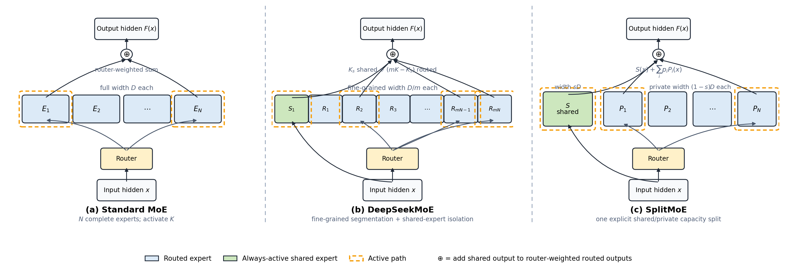

The middle panel shows DeepSeekMoE's combination of fine-grained expert segmentation and shared-expert isolation: the original expert bank is divided into many smaller routed experts, while shared experts remain always active. SplitMoE instead keeps `N` private experts and explicitly allocates a fraction $sD$ of the target active width to one shared FFN and $(1-s)D$ to each private FFN. Orange dashed outlines mark active paths. The $\oplus$ node adds the shared output to the router-weighted routed output; SplitMoE then applies its output multiplier $\alpha$.

## All-MoE scaling results

We replaced every FFN in an 8-layer, width-512 decoder with an MoE and trained three paired seeds for 6,500 optimizer steps. The first experiment used eight experts and Top-1 routing. Split-25 allocated width 256 to the shared path and 768 to each private expert, exactly matching Standard's active FFN width while reducing total stored parameters by 16.4%. These initial runs used effective batch 64, or 106.5M training token positions.

| 8E Top-1 model | Total params | Activated params/token | Validation LM loss | Paired Split − Standard |
| --- | ---: | ---: | ---: | ---: |
| Standard | 134.39M | 46.31M | 3.34034 | — |
| Split-25 | **112.37M** | 46.31M | **3.25393** | **−0.08640 [−0.09483, −0.07798]** |

Split won all three paired seeds and all four validation domains. This result is positive at this scale, but it should not be compared numerically with the earlier 10,000-step experiments because the architecture, number of MoE layers, training horizon, and routing setup differ.

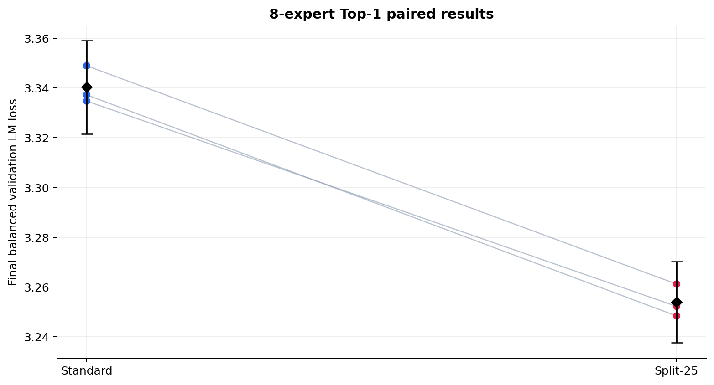

### Batch-matched output-scale control

The confirmatory runs use effective batch 128 on two T4 GPUs, corresponding to 213.0M training token positions. They form a complete $2\times2$ comparison of Standard-1024 and Split-25 at output scales $1$ and $1/\sqrt{2}$. These results are analyzed separately from the earlier effective-batch-64 runs.

| Model | Output scale | Total params | Activated params/token | Validation LM loss |
| --- | ---: | ---: | ---: | ---: |
| Standard-1024 | $1$ | 134.39M | 46.31M | 3.08106 |
| Standard-1024 | $1/\sqrt{2}$ | 134.39M | 46.31M | 3.05994 |
| Split-25 | $1$ | **112.37M** | 46.31M | **3.02495** |
| Split-25 | $1/\sqrt{2}$ | **112.37M** | 46.31M | **3.02425** |
| Standard-800 | $1$ | 112.37M | **43.56M** | 3.08756 |

At scale 1, Split beats Standard by `−0.05611 [−0.07734, −0.03488]`; at scale $1/\sqrt{2}$, it wins by `−0.03569 [−0.05273, −0.01865]`. Both comparisons are paired across seeds and Split wins 3/3 seeds. Split itself changes by only `+0.00069 [−0.00389, +0.00528]` between scales, while Standard improves by `−0.02111` at the smaller scale. Thus scaling affects the architectures differently, but the fixed multiplier does not explain Split's advantage at either tested value.

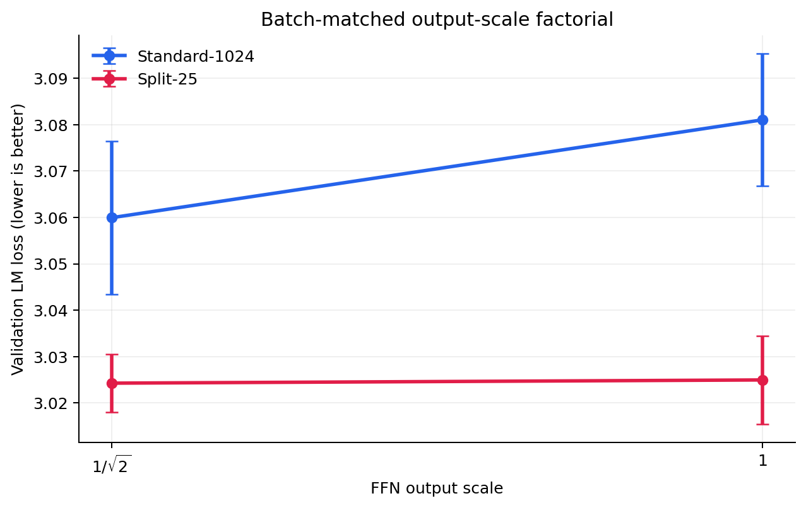

At equal total storage and scale 1, Split-25 beats Standard-800 by `−0.06261 [−0.06340, −0.06183]` in 3/3 seeds. Split activates 6.3% more full-model parameters in this comparison, so it is an equal-storage result rather than an equal-compute result.

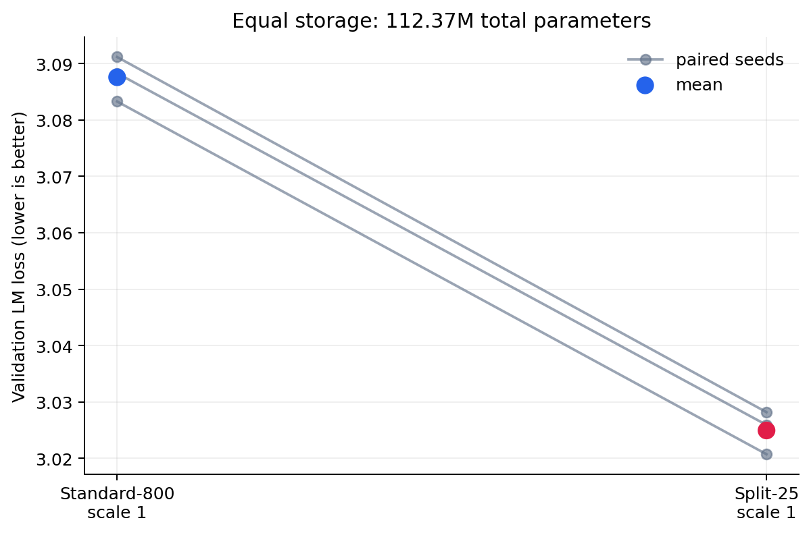

We then increased the routing problem to 16 experts with four active routes. Four variants separate storage, active capacity, and shared-expert allocation:

| 16E Top-4 model | FFN allocation per layer | Total params | Activated params/token | Validation LM loss |
| --- | --- | ---: | ---: | ---: |
| Standard | 16 private × 1024; Top-4 | 235.09M | 84.09M | 3.11376 |
| Practical Split | shared 256 + 16 private × 768; Top-4 | **187.90M** | **74.65M** | 3.12738 |
| Equal-active Split | shared 256 + 16 private × 960; Top-4 | 225.65M | 84.09M | 3.11430 |
| Shared expert | shared 1024 + 15 private × 1024; Top-3 | 235.08M | 84.09M | **3.09983** |

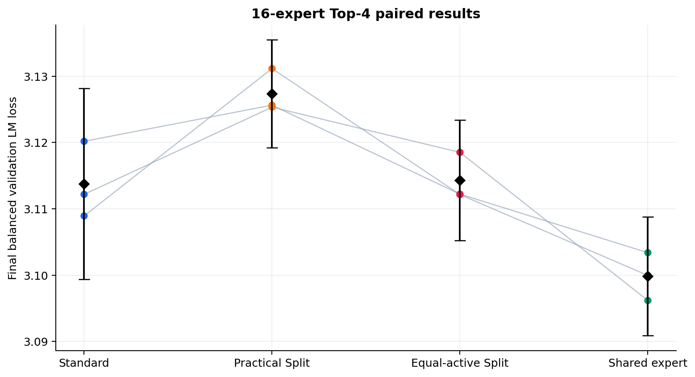

The practical Split configuration reduces total storage by 20.1% and activated parameters by 11.2%, with an observed `+0.01362` loss difference from Standard and paired 95% CI `[−0.00725, +0.03448]`. After active capacity is matched, the difference contracts to `+0.00053 [−0.01815, +0.01921]`: nearly identical observed means, but the preregistered non-inferiority requirement that the upper endpoint be below `+0.01` is not met.

The conventional shared-expert baseline is strongest under Top-4. It beats Standard in all three seeds by `−0.01393 [−0.02463, −0.00323]` and has the better mean at all 26 validation checkpoints. It also beats practical Split by `−0.02754 [−0.03920, −0.01589]`. Its `−0.01446 [−0.03194, +0.00301]` numerical advantage over equal-active Split is not statistically resolved with three seeds.

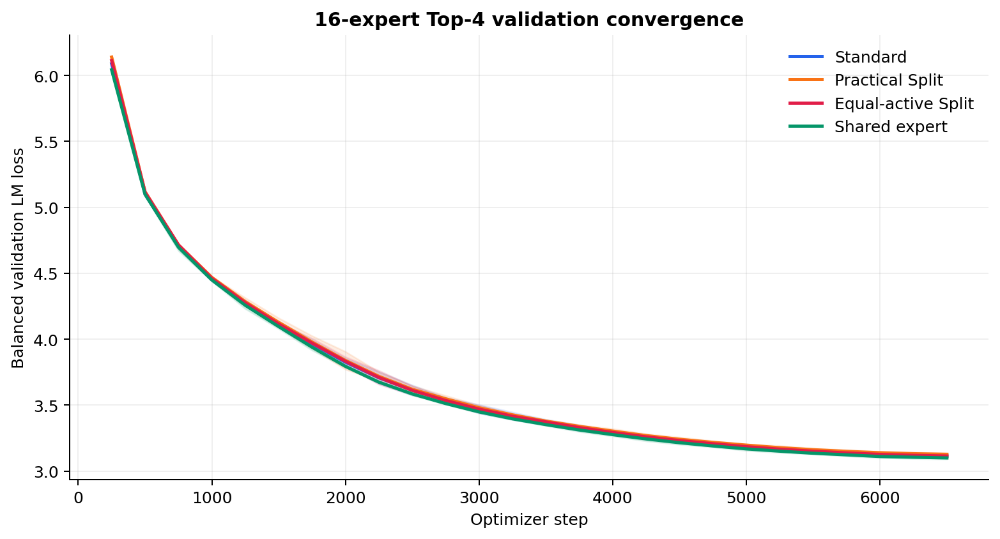

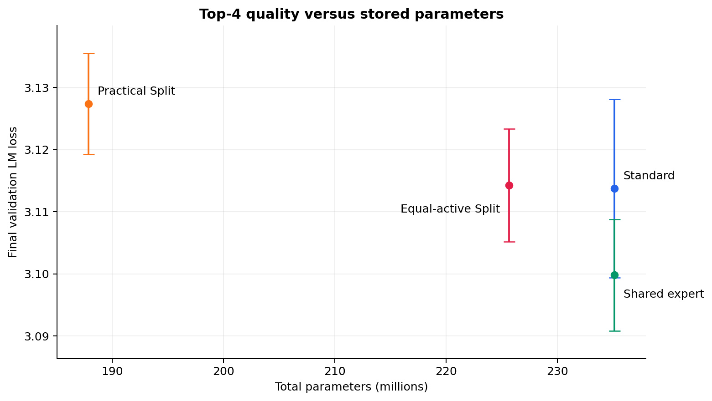

The domain results tell the same broad story: the full shared expert has the lowest mean loss in every domain, while equal-active Split is close to Standard and is numerically better on code and mathematics.

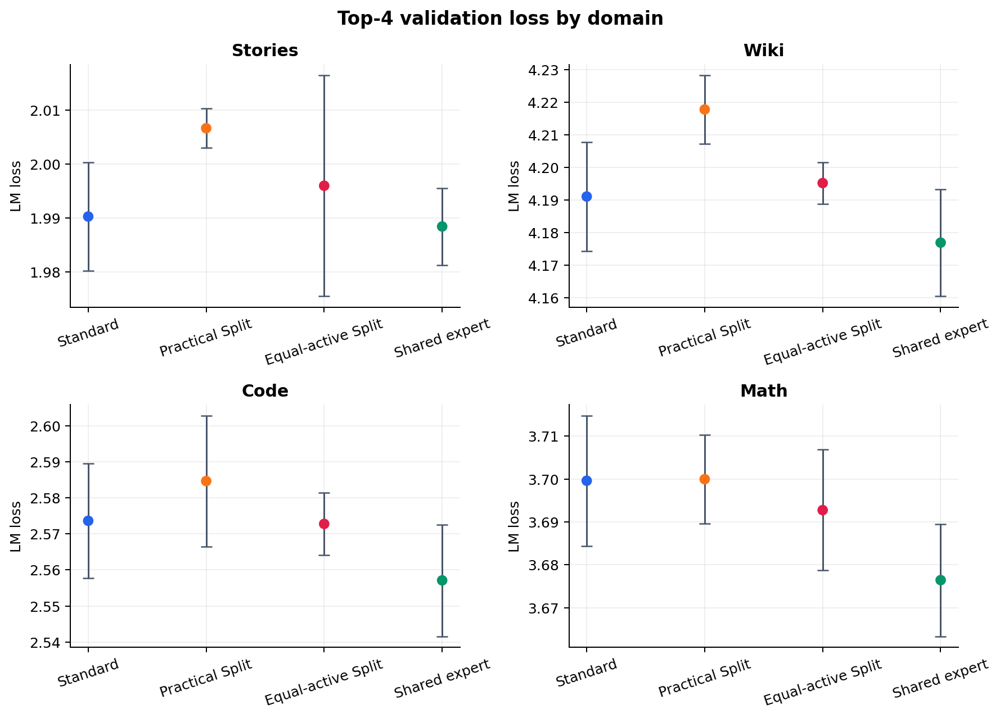

Training throughput does not follow activated parameter count exactly. The shared-expert baseline is marginally faster than Standard, while both partial-width Split variants are slower because they launch a separate shared FFN in addition to routed FFNs. Practical Split nevertheless lowers peak reserved VRAM from 6.38 GiB to 5.32 GiB per GPU.

Using the three SwiGLU projections and counting one multiply-add as two FLOPs, the eight MoE layers require approximately 100.66M FFN-projection FLOPs/token for Standard, equal-active Split, and the shared-expert baseline, versus 81.79M for practical Split. This excludes routing, nonlinearities, attention, embeddings, and the output head; measured throughput remains the more relevant systems result.

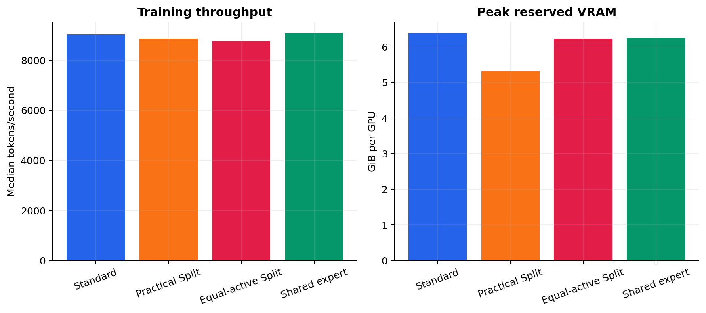

A separate architecture-only benchmark removes training, validation, checkpointing, and W&B overhead. On one Tesla T4 with FP16, batch 4, context 256, 10 warmups, and 50 measured forwards, Standard, practical Split, equal-active Split, and the shared-expert baseline reached 19.32k, 17.36k, 18.31k, and 19.44k tokens/s. Their peak allocated memory was 1.41, 1.16, 1.36, and 1.42 GiB, respectively. These deterministic randomly initialized models isolate reference-implementation cost; they do not reproduce trained routing distributions.

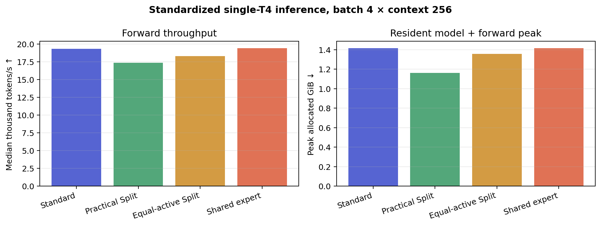

Shared/private activation ratios are depth-dependent. Every shared architecture has a stronger shared path in the first layer; private output dominates most later layers, so the result is not explained by the shared branch replacing private computation everywhere.

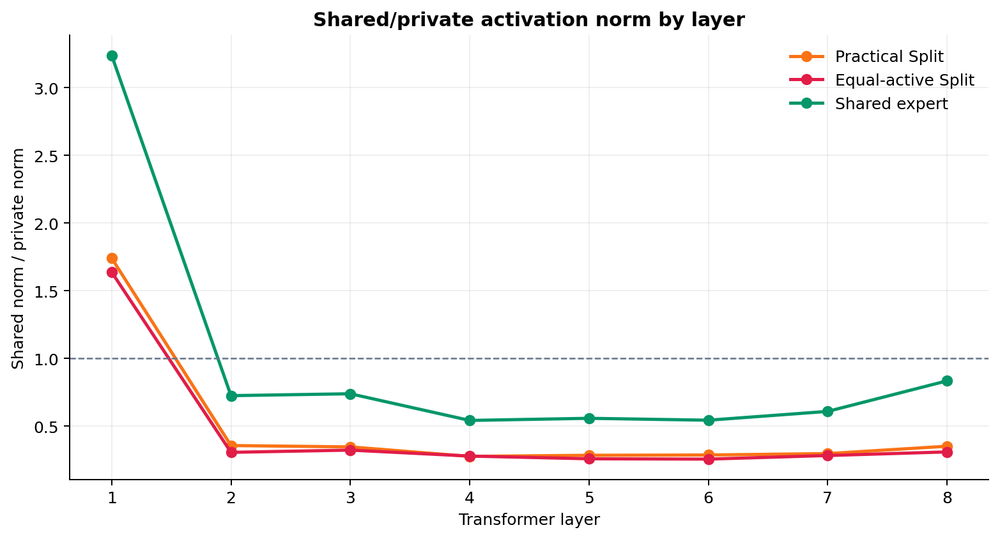

Together, these experiments support a bounded conclusion: reusable always-active capacity is useful, but partial-width factorization is a quality/storage tradeoff rather than a universally superior replacement for conventional shared experts. Under Top-1, Split-25 moves the observed parameter-quality frontier; under Top-4, a full shared expert gives the best quality at matched FFN storage and activation.

## External LAMBADA evaluation

We evaluated existing 6,500-step checkpoints on the 5,153-example English test split of [`EleutherAI/lambada_openai`](https://huggingface.co/datasets/EleutherAI/lambada_openai), a source not intentionally included in the four-domain training mixture. All twelve evaluations use the same CPU FP32 path. Documents are tokenized independently without special tokens; documents longer than the model window retain their final 257 tokens, and batching never pads or joins documents. Full-token autoregressive LM loss is the primary metric. Final-word token loss and exact argmax token-sequence match are teacher-forced diagnostics, not free-running LAMBADA accuracy.

| Held-out comparison | Model | Full LM loss ↓ | Target-token loss ↓ | Teacher-forced exact sequence ↑ |
| --- | --- | ---: | ---: | ---: |
| 8E Top-1 | Standard | 4.96044 | 6.88188 | 5.08% |
| 8E Top-1 | Split-25 | **4.89672** | **6.53296** | **6.97%** |
| 16E Top-4 | Equal-active Split | 4.77157 | 6.20603 | 8.06% |
| 16E Top-4 | Full shared expert | **4.76137** | **6.16261** | **8.23%** |

For Top-1, Split-25 beats Standard in every seed. Its paired full-loss difference is `−0.06372 [−0.10240, −0.02504]`; target-token loss improves by `−0.34892 [−0.51772, −0.18012]`, and teacher-forced exact token-sequence match improves by `+0.01895 [0.00651, 0.03140]`. This corroborates the direction of the in-domain Top-1 result on a separately sourced corpus, but is not a contamination audit.

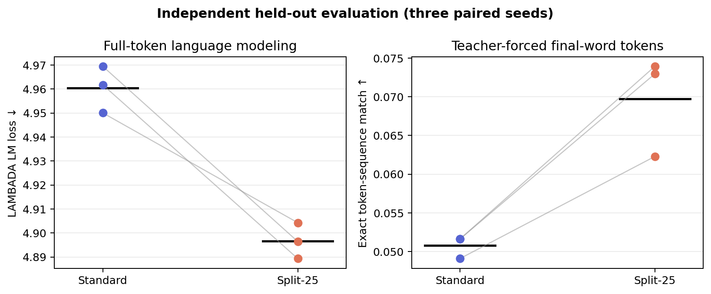

For Top-4, the full shared expert is numerically better on all three seeds in full-token loss, consistent with the in-domain ordering, but the paired equal-active-Split-minus-shared difference of `+0.01019 [−0.00762, +0.02801]` is not statistically resolved. The target-word diagnostic intervals also cross zero.

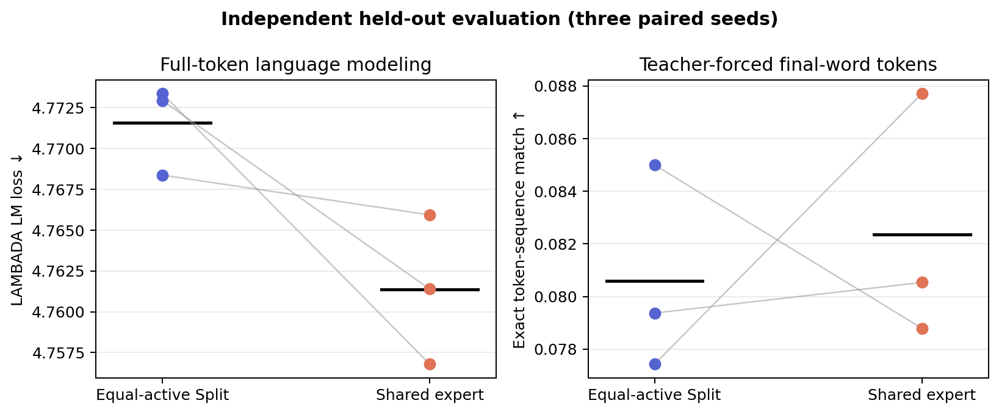

The exact dataset revision, tokenizer revision, preprocessing description, counts, license, and SHA-256 checksums are committed in [`results/heldout/dataset_manifest.json`](results/heldout/dataset_manifest.json). Because the original training mixture was not deduplicated against LAMBADA, this is evidence on a separately sourced corpus rather than a strict contamination audit.

## Parameter frontier and width sweep

We tested three allocations of the same active width of 1024: Split-25 uses `256 shared + 768 private`, Split-50 uses `512 + 512`, and Split-75 uses `768 + 256`. Standard-1024 is the zero-shared endpoint. Dense is shown as a useful fully shared reference, although it has no routed private branch and is not literally the same architecture as a 100% split.

Every result below is the mean of the same five paired seeds after 10,000 optimizer steps. The validation set is fixed and balanced across stories, Wikipedia, code, and mathematics.

| Model | Shared/private width | Total params | Activated params/token | Validation LM loss ↓ | 95% CI |
| --- | ---: | ---: | ---: | ---: | ---: |
| Dense | 1024 / 0 | **46.28M** | 46.28M | 3.08743 | [3.08133, 3.09353] |
| Split-75 | 768 / 256 | 51.00M | 46.29M | 3.06945 | [3.06585, 3.07304] |
| Standard-640 | 0 / 640 | 55.72M | **43.93M** | 3.07874 | [3.07647, 3.08100] |
| Split-50 | 512 / 512 | 55.72M | 46.29M | 3.06436 | [3.05903, 3.06969] |
| Split-25 | 256 / 768 | 60.44M | 46.29M | **3.05981** | [3.05710, 3.06252] |
| Standard-1024 | 0 / 1024 | 65.16M | 46.29M | 3.06119 | [3.05812, 3.06426] |

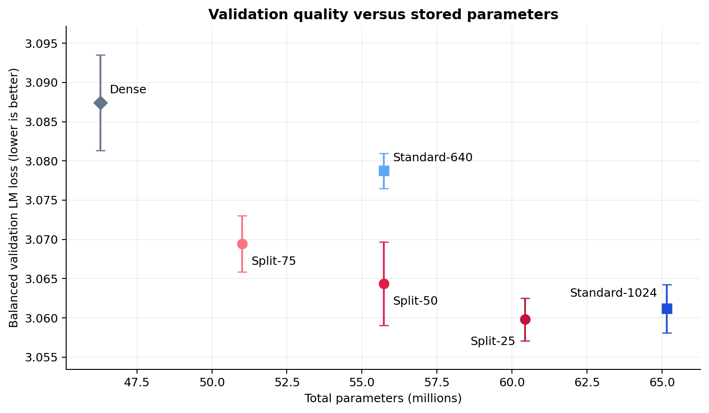

The sweep is not monotonic: allocating some width to a shared path helps parameter efficiency, but allocating most of it to the shared path eventually removes too much conditional capacity. **Among the tested shared fractions, Split-25 achieved the lowest observed mean validation loss while using 7.2% fewer total parameters than Standard-1024.** It also beats Split-50 in all five seeds. Within each replaced MoE layer, it stores width `256 + 4 × 768 = 3328` instead of `4 × 1024 = 4096`, an 18.75% reduction.

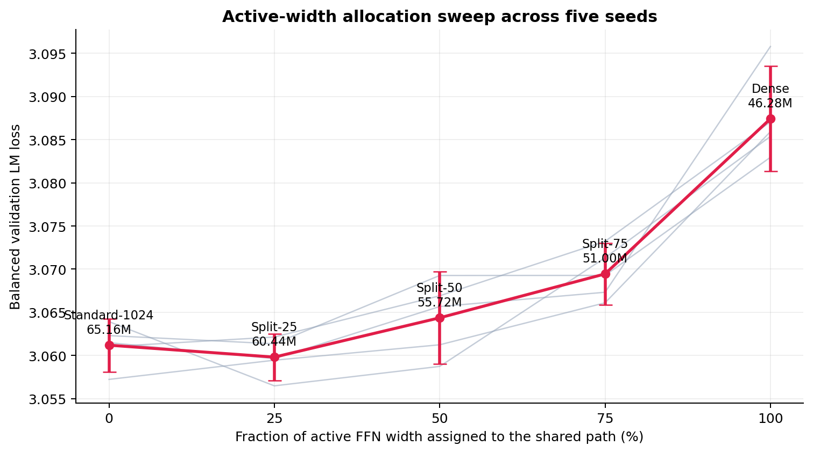

Paired differences use the same seed on both sides and are reported as `left − right`; negative values favor the model on the left.

| Paired comparison | Mean loss difference | 95% CI | Left wins |
| --- | ---: | ---: | ---: |
| Split-25 − Standard-1024 | −0.00138 | [−0.00604, +0.00328] | 3/5 |
| Split-25 − Split-50 | **−0.00455** | **[−0.00775, −0.00136]** | 5/5 |
| Split-75 − Split-50 | +0.00508 | [−0.00098, +0.01115] | 0/5 |
| Split-75 − Dense | **−0.01798** | **[−0.02594, −0.01002]** | 5/5 |
| Split-50 − Standard-640 | **−0.01437** | **[−0.01982, −0.00893]** | 5/5 |
| Standard-640 − Dense | **−0.00869** | **[−0.01700, −0.00038]** | 5/5 |

The Split-25 versus Standard-1024 interval crosses zero, so the experiment does not establish that Split-25 is better. It shows that we did not detect a quality loss despite the storage reduction. The equal-storage control is stronger: Split-50 and Standard-640 both contain exactly 55,722,496 parameters, and Split-50 wins every paired seed by a mean of `0.01437` loss. Split-50 does activate 5.4% more full-model parameters per token, so this comparison isolates the value of spending an equal storage budget on shared plus conditional capacity rather than claiming equal compute.

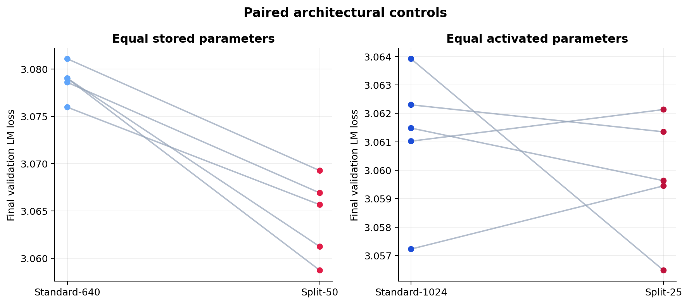

The conclusion is not driven by one domain. Split-25 is numerically best on stories and mathematics, essentially tied with Standard-1024 on Wikipedia, and slightly behind it on code.

| Model | Stories ↓ | Wikipedia ↓ | Code ↓ | Math ↓ |
| --- | ---: | ---: | ---: | ---: |
| Standard-1024 | 1.96246 | 4.18445 | **2.46714** | 3.63029 |
| Split-25 | **1.96054** | **4.18433** | 2.46874 | **3.62519** |
| Split-50 | 1.96669 | 4.18977 | 2.46847 | 3.63210 |
| Split-75 | 1.97500 | 4.19850 | 2.46835 | 3.63551 |

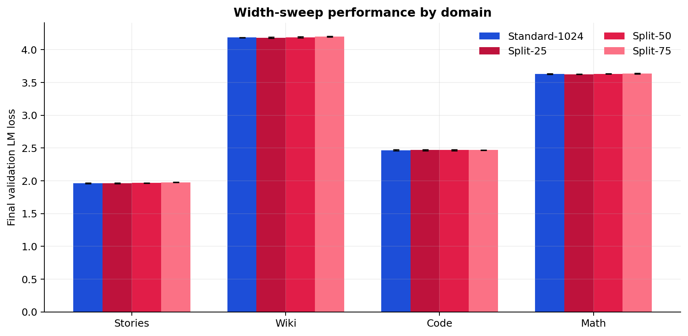

The main finding is therefore more specific than “sharing is always better”: **a modest shared component can remove redundant storage without sacrificing quality, but the private experts still need most of the active width.**

## Initial Split-50 comparison

All variants were trained for 10,000 optimizer steps on 2×T4 GPUs using seeds `1337`, `2027`, `3407`, `4517`, and `5651`. They saw the same pretokenized data and used the same fixed, domain-balanced validation sample. Intervals below are two-sided 95% Student's t intervals over the five seeds.

| Model | Total params | Activated params/token | Validation LM loss ↓ | Perplexity ↓ | Throughput ↑ |
| --- | ---: | ---: | ---: | ---: | ---: |
| Dense | 46.28M | 46.28M | 3.08743 [3.08133, 3.09353] | 21.9208 | 57.0k tok/s |
| Standard MoE | 65.16M | 46.29M | **3.06119** [3.05812, 3.06426] | **21.3530** | 46.0k tok/s |
| SplitMoE | **55.72M** | 46.29M | 3.06436 [3.05903, 3.06969] | 21.4210 | 46.2k tok/s |


The paired final-loss comparisons are more informative than overlapping marginal confidence intervals:

| Comparison (right minus left) | Mean loss difference | 95% CI | Right wins |
| --- | ---: | ---: | ---: |
| Standard MoE − Dense | **−0.02624** | [−0.03319, −0.01929] | 5/5 |
| SplitMoE − Dense | **−0.02306** | [−0.03096, −0.01517] | 5/5 |
| SplitMoE − Standard MoE | +0.00317 | [−0.00283, +0.00917] | 1/5 |


Standard MoE was numerically best on average. SplitMoE trailed it by only `0.00317` loss, about 0.10%, and the paired confidence interval crosses zero. We therefore do not detect a reliable quality difference between them with five seeds. This failure to detect a difference is not a formal proof of equivalence; a future non-inferiority experiment should choose its acceptable margin before training.

The efficiency gain is concrete: compared with Standard MoE, SplitMoE removes 9.44M stored parameters while activating essentially the same number for every token. Within the four replaced MoE FFNs specifically, the shared/private design stores 37.5% fewer parameters.


### Initial models by domain

The original three-model comparison used equal numbers of blocks from stories, Wikipedia, code, and mathematics. Standard-1024 had the lowest mean loss in all four domains relative to Dense and Split-50; the later width sweep above found that Split-25 closes or reverses most of those small gaps.

| Model | Stories ↓ | Wikipedia ↓ | Code ↓ | Math ↓ |
| --- | ---: | ---: | ---: | ---: |
| Dense | 1.98869 | 4.21493 | 2.49104 | 3.65463 |
| Standard MoE | **1.96246** | **4.18445** | **2.46714** | **3.63029** |
| SplitMoE | 1.96669 | 4.18977 | 2.46847 | 3.63210 |


### Did the shared path collapse?

A possible failure mode is that the always-active branch learns everything and leaves the private experts irrelevant. We tracked the ratio of shared to selected-private activation norms:

$$
R = \frac{\lVert S(x)\rVert}{\lVert P_{i^{\ast}}(x)\rVert + \varepsilon}.
$$

Over the final 1,000 steps, the five-seed mean ratios in Transformer layers 2, 4, 6, and 8 were `1.31`, `1.06`, `1.06`, and `1.82`. Neither path vanished in activation magnitude, so there is no obvious shared-path collapse by this diagnostic.


Activation magnitude alone does not establish functional complementarity, so we tested the saved checkpoints directly.

### Post-training route-dependence validation

For every seed, we evaluated 16 evenly spaced validation blocks from each of the four domains. For a token routed to expert $i^{\ast}$, the stricter wrong-expert test evaluates all three alternatives $j \ne i^{\ast}$ separately and averages their losses. This removes dependence on any single counterfactual mapping. Router choices are retained for measurement, and SplitMoE ablations retain the output scale used during training.

| Model and intervention | Mean LM loss | Increase from normal | 95% CI of increase | Positive seeds |
| --- | ---: | ---: | ---: | ---: |
| Standard-640, normal | 3.157 | — | — | — |
| Standard-640, mean over all wrong experts | 3.611 | +0.454 | [+0.425, +0.483] | 5/5 |
| Standard-512, normal | 3.167 | — | — | — |
| Standard-512, mean over all wrong experts | 3.564 | +0.397 | [+0.385, +0.410] | 5/5 |
| Split-50, normal | 3.141 | — | — | — |
| Split-50, mean over all wrong private experts | 3.432 | +0.291 | [+0.272, +0.310] | 5/5 |
| Split-50, shared only | 3.408 | +0.267 | [+0.248, +0.285] | 5/5 |
| Split-50, private only | 3.593 | +0.452 | [+0.373, +0.531] | 5/5 |

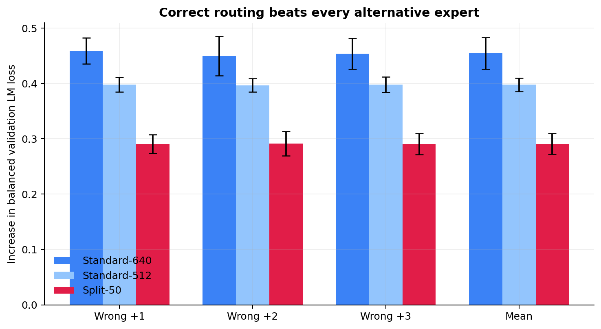

Every individual wrong-expert offset raises loss in all five seeds. More importantly, adding the mean wrong private transformation is worse than omitting the private path entirely by `0.02392` loss, with paired 95% CI `[0.01803, 0.02982]`. Thus the result is not an artifact of one convenient wrong-expert mapping: the router selects conditionally useful private transformations, and inappropriate private transformations actively hurt.

The larger penalties for conventional MoEs are not directly comparable measures of specialization because those interventions replace their entire expert, while SplitMoE retains its shared path and replaces only the private component.

### Layer-by-layer routing dependence

We next corrupted only one MoE layer at a time, averaging over all three alternative experts while leaving routing in every other layer untouched.

| Corrupted layer | Split-50 penalty | 95% CI | Positive seeds |
| ---: | ---: | ---: | ---: |
| 2 | +0.04223 | [+0.03400, +0.05046] | 5/5 |
| 4 | +0.06459 | [+0.04803, +0.08115] | 5/5 |
| 6 | +0.06840 | [+0.06404, +0.07276] | 5/5 |
| 8 | +0.04782 | [+0.04444, +0.05120] | 5/5 |

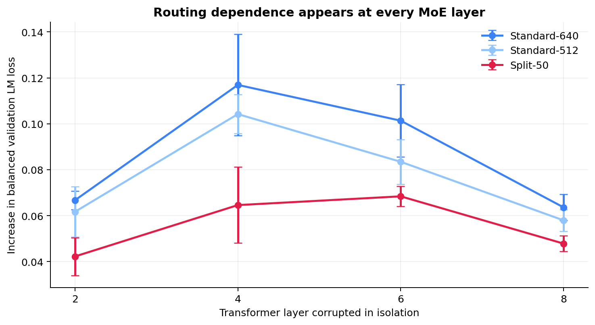

Correct private routing matters independently in every replaced layer, with the largest penalties in the middle layers 4 and 6. The four isolated penalties should not be expected to sum to the global intervention because corruptions interact nonlinearly across layers.

### Same-width expert-redundancy control

Our original comparison found lower similarity for width-512 Split private experts than for width-1024 Standard experts, but expert width was a potential confound. We therefore trained a dedicated Standard-512 model and ran every expert on the same domain-balanced hidden states within each checkpoint. Values below are mean off-diagonal expert-pair similarities over layers and domains.

| Routed component | Centered cosine ↓ | Linear CKA ↓ |
| --- | ---: | ---: |
| Standard-1024 experts | 0.13013 | 0.44509 |
| Standard-640 experts | 0.09469 | 0.40184 |
| Standard-512 experts | 0.08503 | 0.39494 |
| Split-50 private-512 experts | **0.02941** | **0.36851** |

At exactly matched routed width, the paired Split-minus-Standard difference is `−0.05563` for centered cosine, with 95% CI `[−0.06040, −0.05085]`, and `−0.02643` for linear CKA, with 95% CI `[−0.04467, −0.00818]`. Both intervals exclude zero. Reducing conventional expert width does lower similarity, but width alone does not explain the much lower redundancy among Split private experts.

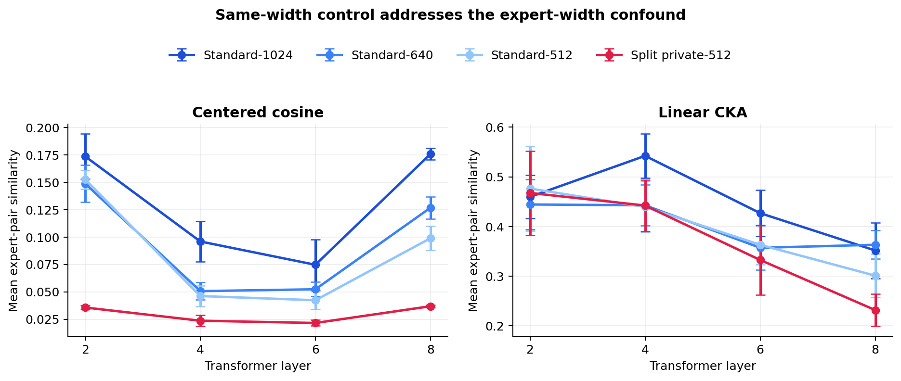

Together, these experiments support two mechanism claims: Split private experts are functionally routing-dependent, and their outputs are less redundant even against conventional experts of the same width. They still do not prove that the shared path represents “common knowledge” in a semantic sense. The interventions are out of distribution, the causal evaluation uses a fixed 64-block diagnostic subset, and similarity is measured on each model's native hidden states.

## Architectures compared

All three variants use the same 8-layer decoder-only Transformer with `d_model=512`, 8 attention heads, context length 256, and SwiGLU FFNs. Only the FFN architecture changes. Standard MoE and SplitMoE replace the FFNs in layers 2, 4, 6, and 8.

### Dense

Every layer has one ordinary width-1024 SwiGLU FFN:

$$
F(x)=W_{\mathrm{down}}\left(\mathrm{silu}(W_{\mathrm{gate}}x)\odot W_{\mathrm{up}}x\right).
$$

Every token uses the same weights. Dense is the control for whether sparse conditional capacity helps at all.

### Standard MoE

Each replaced layer stores four independent width-1024 experts. A learned router selects exactly one for each token:

$$
F(x)=E_{i^{\ast}}(x), \qquad i^{\ast}=\mathop{\mathrm{arg\,max}}_i p_i(x).
$$

Only one expert runs, so the layer activates width 1024 while storing four width-1024 paths.

### SplitMoE

Each replaced layer stores one width-512 shared FFN and four width-512 private FFNs. Every token uses the shared path and one routed private path:

$$
F(x)=\alpha\left(S(x)+P_{i^{\ast}}(x)\right).
$$

The activated width is `512 + 512 = 1024`, matching Standard MoE, while the stored width is `512 + 4 × 512 = 2560` instead of `4 × 1024 = 4096`. Initial experiments set $\alpha=1/\sqrt{2}$; the later control shows Split-25 gives nearly identical validation loss at $\alpha=1$.

| Model | FFN used by one token in a replaced layer | Stored paths | Total params | Activated params/token |
| --- | --- | ---: | ---: | ---: |
| Dense | one width-1024 FFN | 1 | 46,277,120 | 46,277,120 |
| Standard MoE | one selected width-1024 expert | 4 private | 65,159,680 | 46,285,312 |
| SplitMoE | width-512 shared + one width-512 private | 1 shared + 4 private | 55,722,496 | 46,285,312 |

“Activated parameters/token” includes embeddings, attention, ordinary/shared FFNs, routers, and one selected expert in each MoE layer. The MoE variants have 8,192 more active parameters than Dense because their router projections are also active. Matched active parameters do not imply identical runtime: routing, token dispatch, and SplitMoE's two FFN calls add systems overhead.

## Dataset and preprocessing

The training corpus is capped at 100,000 blocks from each of four deliberately different domains:

| Domain | Hugging Face dataset |
| --- | --- |
| Stories | `roneneldan/TinyStories` |
| Wikipedia | `Salesforce/wikitext`, `wikitext-103-raw-v1` |
| Code | `codeparrot/codeparrot-clean` |
| Mathematics | `open-web-math/open-web-math` |

This yields 400,000 blocks, of which 396,537 are training blocks and 3,463 are validation blocks. Blocks contain 256 input tokens plus the next-token target, giving approximately 101.5M training tokens. Documents are streamed, tokenized in batches with `HuggingFaceTB/SmolLM2-135M`, packed within domains, and written to memory-mapped token and domain files. Training therefore performs no tokenization in its hot loop.

## Run it on Kaggle

Enable two T4 GPUs and internet in the Kaggle notebook, then run:

```bash
git clone https://github.com/Priyanshu-5257/SplitMoE.git
cd SplitMoE
pip install -e .
wandb login
```

Pretokenize the dataset once:

```bash
python -m splitmoe.prepare_data \
  --sources data_sources.example.json \
  --output-dir data \
  --tokenizer HuggingFaceTB/SmolLM2-135M \
  --block-size 256 \
  --validation-fraction 0.01
```

The code source uses the script-free Parquet version of `codeparrot/codeparrot-clean`, which is compatible with current Kaggle `datasets` releases. The tokenizer warning about a document exceeding its advertised maximum length is harmless here: preprocessing requests token IDs only and slices them into 257-token blocks before model training.

The completed three-model experiment can be reproduced with the following commands. Each command sequentially runs all five configured seeds while `torchrun` continues to use both GPUs for DDP:

```bash
torchrun --standalone --nproc_per_node=2 -m splitmoe.train --config configs/dense.json
torchrun --standalone --nproc_per_node=2 -m splitmoe.train --config configs/standard_1024.json
torchrun --standalone --nproc_per_node=2 -m splitmoe.train --config configs/split_50.json
```

Runs are logged to the W&B project [`splitmoe-seeds`](https://wandb.ai/hbpkillerx/splitmoe-seeds). Names and checkpoint directories include the seed, for example `split-50-seed-1337` and `checkpoints/split/seed-1337/final.pt`.

### Completed control: total-parameter-matched Standard MoE

The active configuration at `configs/standard.json` trains width-640 experts. Its stored expert width per replaced layer exactly matches Split-50:

$$
4(640) = 512 + 4(512) = 2560.
$$

Reproduce this control with the existing Standard notebook command:

```bash
torchrun --standalone --nproc_per_node=2 -m splitmoe.train --config configs/standard.json
```

This runs the same five seeds and training schedule, writes checkpoints under `checkpoints/standard-640`, and logs separately to the W&B project [`splitmoe-param-matched`](https://wandb.ai/hbpkillerx/splitmoe-param-matched) with names such as `standard-640-seed-1337`. The original width-1024 Standard configuration remains available as `configs/standard_1024.json`.

### Completed experiment: shared/private width sweep

The active `configs/split.json` is a sequential experiment suite containing the two additional active-width decompositions. The 512/512 runs use the separate `configs/split_50.json` configuration:

| Variant | Shared width | Private width | Active width | Total params | Activated params/token |
| --- | ---: | ---: | ---: | ---: | ---: |
| Split-25 | 256 | 768 | 1024 | 60,441,088 | 46,285,312 |
| Split-50 (completed) | 512 | 512 | 1024 | 55,722,496 | 46,285,312 |
| Split-75 | 768 | 256 | 1024 | 51,003,904 | 46,285,312 |

Rerun the existing Split notebook command without changing its arguments:

```bash
torchrun --standalone --nproc_per_node=2 -m splitmoe.train --config configs/split.json
```

It first trains all five Split-25 seeds and then all five Split-75 seeds. Both variants log to the separate W&B project [`splitmoe-width-sweep`](https://wandb.ai/hbpkillerx/splitmoe-width-sweep); checkpoints are written under `checkpoints/split-25` and `checkpoints/split-75`.

### Same-width expert mechanism control

The dedicated `configs/standard_512.json` configuration trains four conventional width-512 experts. This is not intended as a headline quality baseline: it controls for routed-expert width when comparing the output similarity of Standard experts against the width-512 private experts in Split-50. Across five seeds it reached validation loss `3.08721` with 95% CI `[3.08230, 3.09213]`, statistically indistinguishable from Dense in the paired comparison.

```bash
torchrun --standalone --nproc_per_node=2 -m splitmoe.train --config configs/standard_512.json
```

It runs the same five seeds and training schedule, writes checkpoints under `checkpoints/standard-512`, and logs separately to the W&B project [`splitmoe-mechanism-control`](https://wandb.ai/hbpkillerx/splitmoe-mechanism-control) with run names such as `standard-512-seed-1337`.

### Exploratory larger-model comparison

Two dedicated configurations scale the backbone to 10 layers at width 640 and the MoE to 16 experts with normalized Top-4 routing. Only 25% of the experts are active for each token. This is an exploratory single-seed comparison, not a five-seed confirmatory experiment.

| Variant | Expert decomposition | Total params | Activated params/token |
| --- | ---: | ---: | ---: |
| Large Standard-16E-Top4 | `4 × width 1280` active | 256,965,760 | 109,509,760 |
| Large Split-25-16E-Top4 | `shared 320 + 4 × private 960` active | **210,885,760** | **100,293,760** |

The Split configuration stores 23.4375% fewer parameters in its MoE FFNs and 17.9% fewer parameters in the complete model. It also activates 18.75% less MoE-FFN width and 8.4% fewer full-model parameters per token. Selected router probabilities are renormalized across the four active experts before their outputs are combined.

Run the two Kaggle notebooks with:

```bash
torchrun --standalone --nproc_per_node=2 -m splitmoe.train --config configs/large_standard_16e_top4.json
torchrun --standalone --nproc_per_node=2 -m splitmoe.train --config configs/large_split25_16e_top4.json
```

Both use seed `1337`, the existing pretokenized data and unchanged 10,000-step schedule. They preserve an effective batch size of 64 sequences using micro-batches of 4 and eight gradient-accumulation steps. Results log separately to the W&B project [`splitmoe-large-16e-top4`](https://wandb.ai/hbpkillerx/splitmoe-large-16e-top4) as `large-standard-16e-top4-seed-1337` and `large-split25-16e-top4-seed-1337`.

### Exploratory all-MoE scaling comparison

The next single-seed comparison expands the model to 12 layers and replaces the FFN in every layer with an MoE (`moe_every = 1`). Both variants use width 640, 16 experts, and normalized Top-4 routing.

| Variant | Expert decomposition | Total params | Activated params/token |
| --- | ---: | ---: | ---: |
| XLarge all-MoE Standard | `4 × width 1280` active | 523,280,000 | 169,385,600 |
| XLarge all-MoE Split-25 | `shared 320 + 4 × private 960` active | **412,688,000** | **147,267,200** |

Split-25 stores 110.59M fewer total parameters (21.13%) and activates 22.12M fewer parameters per token (13.06%). The configs retain the previous effective batch size of 64 sequences by using a micro-batch size of 1 and 32 gradient-accumulation steps on each of two GPUs.

Run both sequentially without changing the existing Kaggle `torchrun` arguments:

```bash
torchrun --standalone --nproc_per_node=2 -m splitmoe.train --config configs/xlarge_allmoe_16e_top4.json
```

Alternatively, run them separately with `configs/xlarge_allmoe_standard_16e_top4.json` and `configs/xlarge_allmoe_split25_16e_top4.json`. Runs log to the separate W&B project `splitmoe-xlarge-allmoe-16e-top4` with variant-specific names and checkpoint directories.

### Budgeted all-MoE paper controls on Modal

The paper-focused configs use an MoE in all eight Transformer layers, eight experts, Top-1 routing, 6,500 optimizer steps, and three paired seeds. Standard-1024 and Split-25 exactly match activated parameters; Split-25 and Standard-800 exactly match total stored parameters.

| Variant | Total params | Activated params/token | Control |
| --- | ---: | ---: | --- |
| Standard-1024 | 134,390,272 | 46,309,888 | conventional MoE |
| Split-25 | **112,370,176** | 46,309,888 | equal activation |
| Standard-800 | 112,370,176 | **43,557,376** | equal storage |

The Modal runner stores the pretokenized corpus and resumable checkpoints in the `splitmoe-paper` Volume. Each invocation trains only one variant and seed, resumes an existing `latest.pt`, continues the same W&B run, logs peak VRAM, and replaces the optimizer checkpoint with a model-only checkpoint after successful completion.

```bash
# One-time data preparation.
modal run scripts/modal_train.py --action prepare

# Compare short benchmarks before choosing the lowest-cost GPU.
modal run scripts/modal_train.py --action benchmark --gpu T4 --steps 100 --max-cost 0.25
modal run scripts/modal_train.py --action benchmark --gpu L4 --steps 100 --max-cost 0.25
modal run scripts/modal_train.py --action benchmark --gpu A10 --steps 100 --max-cost 0.25

# Inspect durable dataset/checkpoint state without allocating a GPU.
modal run scripts/modal_train.py --action status
```

The 100-step benchmark selected T4 as the lowest-cost option for this workload:

| GPU | Median tok/s | Elapsed | Estimated GPU cost |
| --- | ---: | ---: | ---: |
| T4 | 10,212 | 174.3 s | **$0.0286** |
| L4 | 12,660 | 139.6 s | $0.0310 |
| A10 | **14,464** | **121.9 s** | $0.0373 |

The raw benchmark record is committed as [`results/modal_benchmark.json`](results/modal_benchmark.json). Training uses two CPU cores and 4 GiB RAM per container. At the measured T4 rate and published Modal resource prices, one 6,500-step run projects to approximately `$2.26` in total compute and the six primary paired runs to approximately `$13.53`. These are projections rather than spending guarantees; storage, optional regional multipliers, and full-run validation/checkpoint overhead may add cost.

Real training requires a Modal secret named `wandb-secret` containing `WANDB_API_KEY`. A run is launched explicitly so its total-compute cap is visible:

```bash
modal run --detach scripts/modal_train.py \
  --action train \
  --config paper_allmoe_split25.json \
  --seed 1337 \
  --gpu T4 \
  --max-cost 2.35
```

Training uses Modal's durable `Function.spawn()` invocation. Run the command with `modal run --detach scripts/modal_train.py ...`; after it prints a `function_call_id`, the training call no longer depends on the client process and continues if the launching laptop sleeps or disconnects. Re-running the same variant and seed resumes its latest durable checkpoint rather than starting over.

The cap estimates GPU charges from the public per-second rate; CPU, memory, storage, and regional multipliers are additional. Run the two primary variants for seeds `1337`, `2027`, and `3407` before spending the remaining budget on Standard-800. Full rationale and stopping rules are in [`PAPER_PLAN.md`](PAPER_PLAN.md).

Each GPU holds a complete model and processes different batches. There is no expert-parallel all-to-all communication, keeping this an architecture experiment rather than a distributed-systems comparison. If T4 memory is tight, lower `micro_batch_size` and increase `gradient_accumulation_steps` by the same factor. T4 should use FP16, not BF16.

## Reproduce the result exports

The raw per-seed metrics, validation histories, norm histories, aggregate statistics, and figures are committed under [`results/five_seed`](results/five_seed). Regenerate them directly from the public W&B runs with:

```bash
pip install -e '.[analysis]'
python scripts/export_seed_results.py
```

The three-seed all-MoE Top-1 and Top-4 tables, complete validation histories, router summaries, statistical comparisons, and plots are committed under [`results/paper_scaling`](results/paper_scaling). Regenerate the report from the four public W&B projects with:

```bash
python scripts/export_paper_scaling_results.py
```

The parameter-frontier tables, per-seed metrics, and plots are committed under [`results/frontier`](results/frontier). Regenerate them from all three public W&B projects with:

```bash
python scripts/export_frontier_results.py
```

The stricter causal interventions, exact-width similarity control, per-seed JSON records, aggregate statistics, and figures are committed under [`results/mechanism`](results/mechanism). Pull the Standard-512 training metrics and aggregate checkpoint analyses with:

```bash
python scripts/export_standard512_results.py

for seed in 1337 2027 3407 4517 5651; do
  PYTHONPATH=src python scripts/analyze_checkpoint.py \
    --checkpoint "checkpoints/standard-512/seed-$seed/final.pt" \
    --validation-data data/validation \
    --output "results/mechanism/raw/standard512_seed_${seed}.json" \
    --batch-size 8
done

python scripts/summarize_mechanism_results.py
```

The committed mechanism summary combines Standard-512 with analogous Standard-640 and Split-50 records. The original causal export under [`results/causal`](results/causal) used one deterministic counterfactual assignment; the all-alternatives analysis supersedes it.

The earlier single-seed pilot remains under [`results`](results). Its validation slice contained stories only because evaluation consumed the first source-ordered blocks. The five-seed experiment corrected this with a fixed `DomainBalancedSampler`; the pilot should not be used as the headline result.

### External evaluation and systems artifacts

Prepare the pinned English LAMBADA test set, evaluate a model-only checkpoint, and rebuild the paired report with:

```bash
splitmoe-prepare-heldout --output-dir data/heldout/lambada_openai_en

PYTHONPATH=src python scripts/evaluate_heldout.py \
  --checkpoint checkpoints/example/final.pt \
  --data data/heldout/lambada_openai_en \
  --output results/heldout/raw/example.json \
  --device cpu

python scripts/summarize_heldout_results.py
```

The committed [`results/heldout/dataset_manifest.json`](results/heldout/dataset_manifest.json) pins the dataset and tokenizer revisions and includes source-text and token-file SHA-256 checksums. Aggregation requires the standardized CPU path and three paired 6,500-step checkpoints for each reported model.

Rebuild the systems table and figure from the committed raw single-T4 records with:

```bash
python scripts/summarize_systems_results.py
```

## Logged diagnostics

W&B records language-model loss, total loss, overall and per-domain validation perplexity, learning rate, gradient norm, throughput, router entropy, expert load, shared/private activation norms, and domain-conditioned routing.

`lm_loss` is the next-token cross-entropy used to compare model quality. For MoE models, `loss` additionally includes load-balancing and router z-loss terms:

$$
L_{\mathrm{total}} = L_{\mathrm{LM}} + \lambda_{\mathrm{balance}}L_{\mathrm{balance}} + \lambda_z L_z.
$$

Analyze centered pairwise expert-output similarity from a saved checkpoint with:

```bash
python -m splitmoe.analyze --checkpoint checkpoints/split/seed-1337/final.pt --batches 8
```

Treat similarity as a diagnostic, not standalone proof of specialization.

## Local verification

No dataset download or W&B account is needed for tests:

```bash
pip install -e '.[dev]'
pytest -q
python scripts/smoke_test.py
python scripts/smoke_test.py --ddp
python scripts/smoke_test.py --multi-seed
python scripts/smoke_test.py --top-k 4
```

### Reviewer-control runs

The predeclared output-scaling control completed a 2-by-2 comparison of Standard-1024 and Split-25 at output scales $1$ and $1/\sqrt{2}$. It also added a width-800 Standard baseline with exactly the same total parameter count as Split-25. The first launch revealed that the older Modal runs used effective batch 64 while the two-T4 Kaggle controls used effective batch 128; the two budgets are therefore analyzed separately, and two additional batch-128 cells completed the valid factorial. Aggregate statistics, per-seed records, trajectories, provenance, and figures are in [`results/reviewer_controls`](results/reviewer_controls). The hypotheses and statistical protocol were frozen in [`PAPER_PLAN.md`](PAPER_PLAN.md#reviewer-control-experiment-output-scaling-and-matched-storage) and timestamped by commit [`60f2f68`](https://github.com/Priyanshu-5257/SplitMoE/commit/60f2f68); the corrective batch-matched cells were recorded in [`fa9e55b`](https://github.com/Priyanshu-5257/SplitMoE/commit/fa9e55b) before they ran.

Each seed can be launched independently on 2-GPU Kaggle with the same command shape:

```bash
torchrun --standalone --nproc_per_node=2 -m splitmoe.train \
  --config configs/review_split25_scale1.json --seed 1337

torchrun --standalone --nproc_per_node=2 -m splitmoe.train \
  --config configs/review_standard1024_scale07071.json --seed 1337

torchrun --standalone --nproc_per_node=2 -m splitmoe.train \
  --config configs/review_standard800_scale1.json --seed 1337
```

Replace `1337` with `2027` or `3407` for the other paired seeds. W&B uses the projects `splitmoe-paper-review-scale` and `splitmoe-paper-review-storage`, with the seed appended to every run name.

The smoke test creates a temporary memory-mapped dataset, performs optimizer steps, evaluates, and saves a checkpoint.

## Reproducibility notes

- Variants within each reported paired comparison use the same seeds, pretokenized blocks, optimizer schedule, and fixed validation sample.
- Initial all-MoE runs use effective batch 64 and 106.5M token positions. Reviewer-control runs use effective batch 128 and 213.0M token positions; results from these budgets are not pooled.
- The default router uses a straight-through selected gate: its forward scale is one while task gradients still reach the router.
- Auxiliary load balancing and router z-loss are included in total loss but not in `lm_loss`.
- Data are packed within domains, so each block has one unambiguous domain label.
- The original training-data source revisions were not pinned; the external LAMBADA evaluation added for the paper pins both dataset and tokenizer revisions and publishes content checksums.
- No capacity-based token dropping or expert-parallel communication is used.
- Checkpoints are written atomically and include model, optimizer, scaler, step, and configuration.

The referenced datasets retain their own licenses. Review their dataset cards before redistributing raw or pretokenized data.
