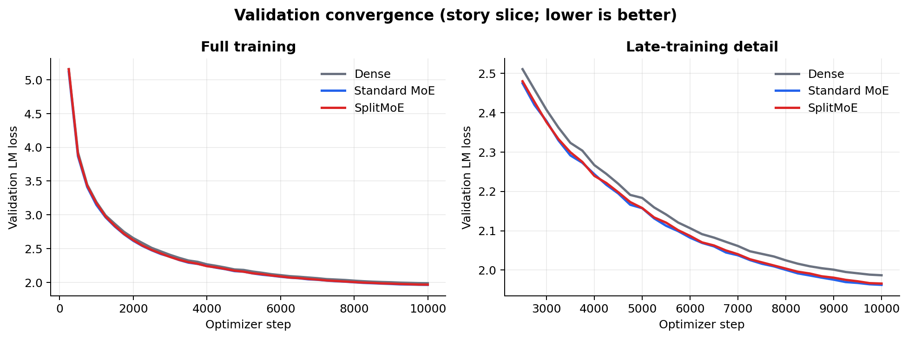
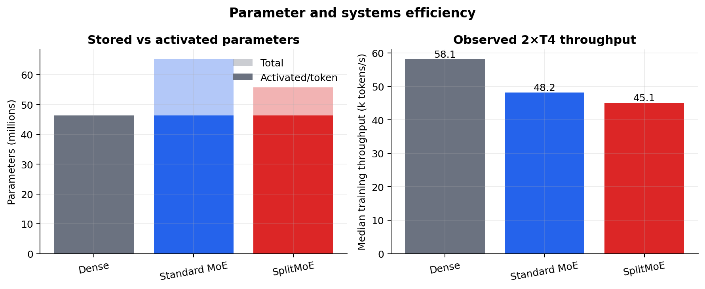
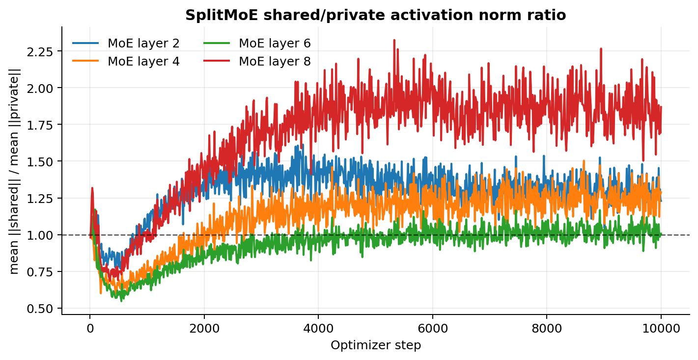

# SplitMoE

SplitMoE is a compact research codebase for testing whether an MoE layer benefits from explicitly splitting active FFN capacity into a shared path and a routed private path:

$$
y = x + \frac{1}{\sqrt{2}}\left(S(x) + P_{i^{\ast}}(x)\right).
$$

It includes compute-matched Dense, standard Top-1 MoE, and SplitMoE configurations; streaming pretokenization into memory-mapped blocks; single-GPU and PyTorch DDP training; Weights & Biases logging; domain-conditioned routing statistics; shared/private norm tracking; and post-training expert-similarity analysis.

## Architectures being compared

All three models are the same 8-layer decoder-only Transformer with `d_model=512`, 8 attention heads, context length 256, and SwiGLU FFNs. Only the FFN architecture changes. Standard MoE and SplitMoE replace the FFN in layers 2, 4, 6, and 8; their other layers remain ordinary dense FFNs.

### Dense

Every Transformer layer contains one ordinary width-1024 SwiGLU FFN:

$$
F(x)=W_{down}\left(\mathrm{silu}(W_{gate}x)\odot W_{up}x\right).
$$

Every token passes through the same FFN, so there is no router or expert specialization. This is the control that tells us whether sparse conditional capacity helps at all.

### Standard MoE

Each MoE layer stores four independent width-1024 SwiGLU experts. A learned router chooses exactly one expert for each token:

$$
i^{\ast}=\arg\max_i p_i(x), \qquad F(x)=E_{i^{\ast}}(x).
$$

Only the selected expert runs, giving width 1024 of active FFN computation per token while storing four times that expert capacity. This is the conventional Top-1 sparse-MoE baseline.

### SplitMoE

Each MoE layer contains one always-active width-512 shared FFN and four width-512 private experts. The router chooses one private expert per token:

$$
F(x)=\frac{1}{\sqrt{2}}\left(S(x)+P_{i^{\ast}}(x)\right),
\qquad i^{\ast}=\arg\max_i p_i(x).
$$

The shared branch is intended to learn transformations useful to every token, while the routed private branches learn specialized residual transformations. Each token activates width `512 + 512 = 1024`, matching the active width of Dense and Standard MoE, but SplitMoE stores fewer expert parameters than Standard MoE.

| Model | FFN used by one token in a compared layer | Stored conditional paths | Total parameters | Activated parameters/token |
| --- | --- | ---: | ---: | ---: |
| Dense | one width-1024 dense FFN | 1 | 46.28M | 46.28M |
| Standard MoE | one selected width-1024 expert | 4 | 65.16M | 46.29M |
| SplitMoE | width-512 shared + one selected width-512 private expert | 1 shared + 4 private | 55.72M | 46.29M |

“Activated parameters/token” counts all embeddings, attention, dense/shared FFNs, routers, and one selected expert in each MoE layer. The MoE values are 8,192 parameters larger than Dense because their four router projections are also active. This parameter count describes active weights, not exact runtime FLOPs; routing and token dispatch add some overhead.

The primary comparison is therefore at approximately matched active FFN computation, not matched total parameter count. Use `validation/lm_loss` to compare language-model quality; the reported total loss also includes the router auxiliary terms for the MoE variants.

## Initial 4-expert results

All three models were trained for 10,000 optimizer steps on 2×T4 GPUs with the same seed, tokenized data, effective batch size of 64 sequences, and approximately matched activated parameters. Each model reached its best recorded validation loss at step 10,000.

| Model | Total params | Activated params/token | Final validation LM loss ↓ | Perplexity ↓ | Median throughput ↑ | Runtime |
| --- | ---: | ---: | ---: | ---: | ---: | ---: |
| Dense | 46.28M | 46.28M | 1.98686 | 7.2926 | 58.1k tok/s | 50.2 min |
| Standard MoE | 65.16M | 46.29M | **1.96249** | **7.1170** | 48.2k tok/s | 59.8 min |
| SplitMoE | 55.72M | 46.29M | 1.96582 | 7.1407 | 45.1k tok/s | 63.7 min |



Both MoE variants beat Dense at all 40 validation checkpoints. Standard MoE achieved the best final loss. SplitMoE finished only `0.00333` LM-loss points (about 0.17%) behind Standard while storing 9.44M fewer parameters—a 14.5% reduction in total parameters. This run therefore supports a parameter-efficiency result, not a claim that SplitMoE already improves raw quality over Standard MoE.



The current routed-expert implementation prioritizes clarity over fused-kernel performance. SplitMoE's two FFN paths and Python-level dispatch make it about 6.5% slower than Standard MoE in this experiment even though their theoretical active FFN widths match.



The shared/private norm ratio remains in a usable range rather than collapsing to an overwhelmingly shared solution. Over the final 1,000 steps, its mean was approximately 1.29, 1.25, 1.02, and 1.84 in MoE layers 2, 4, 6, and 8 respectively. Expert utilization also remained close to 25% per expert, with no dead experts.

> **Validation limitation:** these first results use the first 50 DDP validation batches. Because pretokenized blocks were written in source order, that slice contains stories only; the zero code/math/wiki routing entries in W&B confirm this. The comparison is controlled because all models used the same slice, but these numbers must not be presented as balanced four-domain validation. A stratified per-domain evaluation of the saved checkpoints is required next. This is also a single-seed result.

The underlying exports are committed as [`summary.json`](results/summary.json), [`validation_history.csv`](results/validation_history.csv), and [`split_norm_history.csv`](results/split_norm_history.csv). Source runs: [Dense](https://wandb.ai/hbpkillerx/splitmoe/runs/3ewbsmej), [Standard MoE](https://wandb.ai/hbpkillerx/splitmoe/runs/qi97vvu9), and [SplitMoE](https://wandb.ai/hbpkillerx/splitmoe/runs/pp7z3b7x).

Regenerate the committed exports and figures with:

```bash
pip install -e '.[analysis]'
python scripts/export_results.py
```

## Kaggle: pull and run

Enable both T4 GPUs and internet in the Kaggle notebook settings, then run:

```bash
git clone https://github.com/Priyanshu-5257/SplitMoE.git
cd SplitMoE
pip install -e .
wandb login
```

Pretokenize the four-domain corpus once. This streams documents instead of downloading the complete source datasets and writes fixed `(context + 1)` token blocks. Training then reads them through `numpy.memmap`, so tokenization is entirely outside the hot training loop.

```bash
python -m splitmoe.prepare_data \
  --sources data_sources.example.json \
  --output-dir data \
  --tokenizer HuggingFaceTB/SmolLM2-135M \
  --block-size 256 \
  --validation-fraction 0.01
```

The example caps each domain at 100,000 blocks (about 25.6M input tokens), preventing corpus size from becoming a routing confound. Reduce each `max_blocks` for a short Kaggle run or raise it for the full experiment. Check `data/train/metadata.json` after preprocessing: its `vocab_size` must match `model.vocab_size` in every experiment config.

The code portion uses the script-free, auto-converted Parquet view of `codeparrot/codeparrot-clean`, which is compatible with current versions of Hugging Face `datasets` used by Kaggle.

Launch the compute-matched experiments on both GPUs. The commands are unchanged, but each command now trains five runs sequentially with seeds `1337`, `2027`, `3407`, `4517`, and `5651`:

```bash
torchrun --standalone --nproc_per_node=2 -m splitmoe.train --config configs/dense.json
torchrun --standalone --nproc_per_node=2 -m splitmoe.train --config configs/standard.json
torchrun --standalone --nproc_per_node=2 -m splitmoe.train --config configs/split.json
```

The replication runs are logged to the separate W&B project `splitmoe-seeds`, preserving the original `splitmoe` project. Run names and checkpoint directories include the seed, for example:

```text
split-50-seed-1337
checkpoints/split/seed-1337/final.pt
```

Validation now uses a fixed, domain-balanced sample on every rank and logs overall plus per-domain LM loss/perplexity. This corrects the source-order limitation documented for the initial single-seed results above. The same fixed validation blocks are used for every architecture and seed.

Based on the initial run times, expect approximately 4.2 hours for five Dense seeds, 5.0 hours for five Standard-MoE seeds, and 5.3 hours for five SplitMoE seeds. Use separate Kaggle sessions if the combined runtime would exceed the notebook limit. Completed seeds retain only `final.pt`; the redundant periodic `latest.pt` is removed to reduce disk use.

Each GPU holds the complete model and receives different batches. There is no expert-parallel all-to-all communication, keeping this an architecture experiment rather than a distributed-systems comparison.

If T4 memory is tight, lower `micro_batch_size` and raise `gradient_accumulation_steps` by the same factor. T4 should use FP16, not BF16.

## Local verification

No dataset download or W&B account is needed for tests:

```bash
pip install -e '.[dev]'
pytest -q
python scripts/smoke_test.py
python scripts/smoke_test.py --ddp
python scripts/smoke_test.py --multi-seed
```

The smoke test creates a temporary memory-mapped dataset, performs optimizer steps, evaluates, and saves a checkpoint.

## Experiment controls

The supplied Standard and Split configurations match active SwiGLU width:

- Standard: one selected expert of width 1024.
- Split: one always-active shared FFN of width 512 plus one selected private FFN of width 512.

This is a compute-matched comparison, not a total-parameter-matched comparison. To parameter-match a 4-expert Standard MoE with shared width 512, use private width 896, since

$$
512 + 4(896) = 4(1024).
$$

Run both comparisons before making claims about architectural quality versus parameter efficiency.

The default router mode is `straight_through`. Its selected gate is divided by a detached copy, producing a forward scale of exactly one while retaining task gradients for the router. Available modes are:

- `straight_through`: unattenuated expert output with router task gradients; recommended first run.
- `probability`: multiply the selected expert by its softmax probability.
- `none`: hard unweighted routing; the router then learns only from auxiliary router losses.

## Logged measurements

W&B receives language-model and total loss, overall and per-domain validation perplexity, learning rate, gradient norm, tokens/second, router entropy, load per expert, shared/private activation norms and their ratio, and `P(expert | domain)` during validation.

Measure centered expert-output similarity after training:

```bash
python -m splitmoe.analyze --checkpoint checkpoints/split/seed-1337/final.pt --batches 8
```

The output is one expert-by-expert similarity matrix per MoE layer. Treat similarity as a diagnostic rather than standalone proof of specialization; loss ablations and wrong-expert substitution are stronger follow-up tests.

## Reproducibility notes

- All variants use the same five predefined seeds and pretokenized blocks.
- Auxiliary load balancing and router z-loss are included in the reported total loss; `lm_loss` is logged separately.
- Data are packed within each domain, so a block has one domain label and domain-routing measurements are not contaminated by cross-domain packing.
- No capacity-based token dropping is used in this single-node implementation.
- Checkpoints are written atomically and include model, optimizer, scaler, step, and full configuration.

The referenced datasets retain their own licenses. Review their dataset cards before redistributing either raw or pretokenized data.
