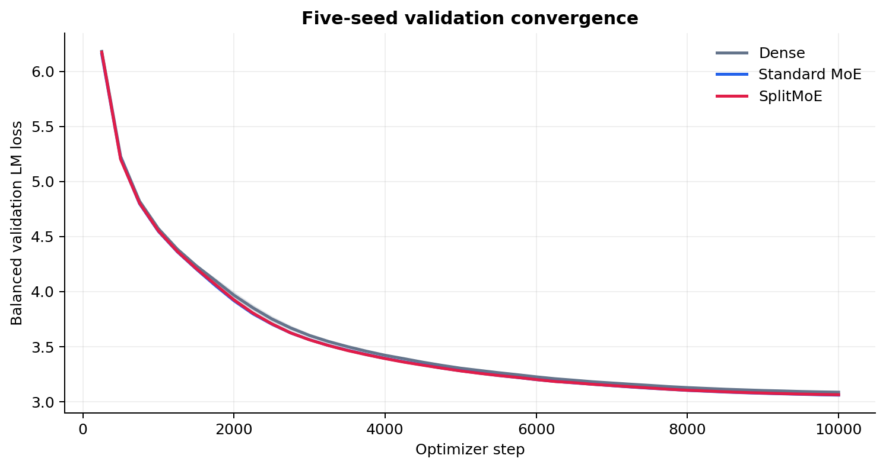
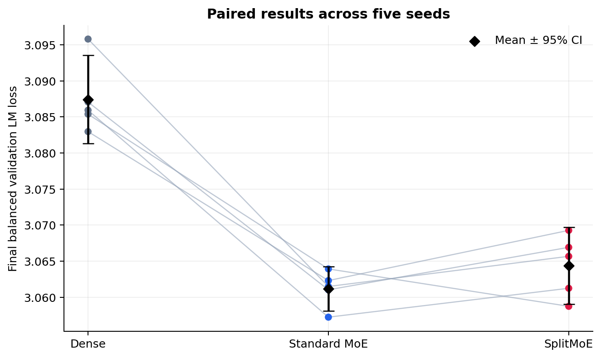
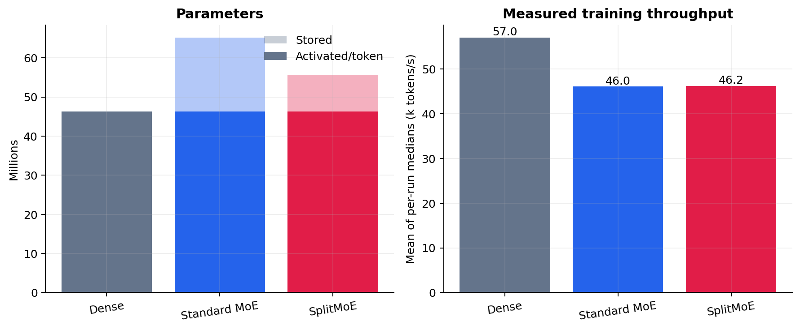
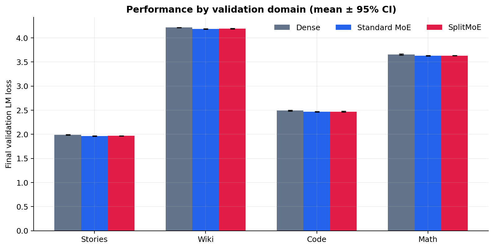
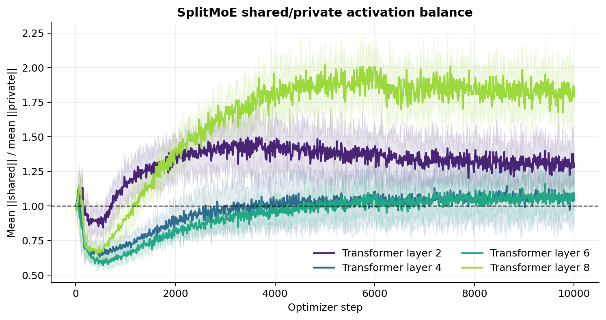
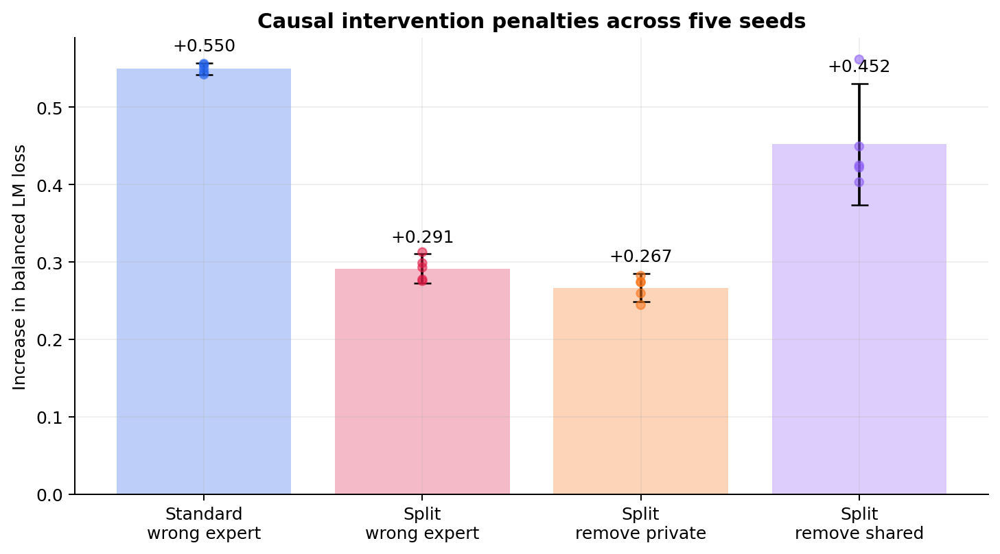
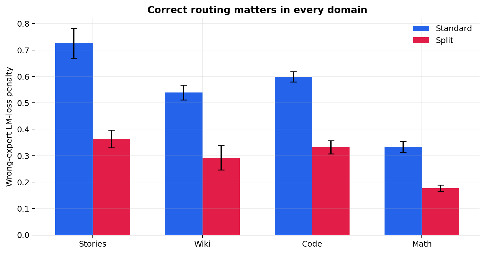
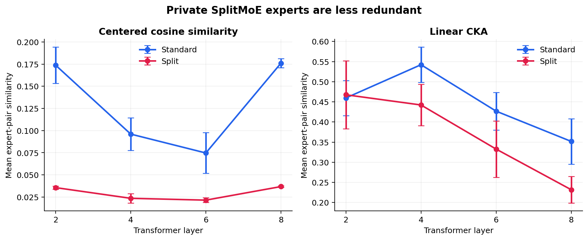

# SplitMoE

## The intuition

Sparse Mixture-of-Experts models store several independent feed-forward experts in a layer but route each token through only a few of them. This creates conditional capacity, but it also raises a simple question: **are the experts wasting parameters by independently relearning transformations that every expert needs?**

Suppose a layer has `N` experts. Instead of treating expert `i` as an unrelated function, we hypothesize that it can be decomposed into a common component and a specialization:

$$
E_i(x) = S(x) + P_i(x).
$$

Here, $S$ is shared by every expert in the layer and $P_i$ is private to expert $i$. For normalized routing weights, this gives:

$$
\sum_i p_i(x)E_i(x) = S(x) + \sum_i p_i(x)P_i(x).
$$

The common computation now needs to be stored and evaluated only once. The router's job also changes subtly: it chooses the specialization needed **after common capacity has already been provided**.

This repository tests that idea with a controlled SplitMoE layer:

$$
F_{\mathrm{split}}(x) = \frac{1}{\sqrt{2}}\left(S(x) + P_{i^{\ast}}(x)\right), \qquad i^{\ast}=\mathop{\mathrm{arg\,max}}_i p_i(x).
$$

Rather than adding a full shared expert on top of a normal MoE, SplitMoE divides the same active FFN width between a shared branch and one routed private branch. This lets us ask a precise question:

> At matched activated capacity, can a shared/private MoE retain the quality of a conventional Top-1 MoE while storing fewer parameters?

## Result in one sentence

**Across five seeds on a balanced four-domain corpus, SplitMoE matched conventional Top-1 MoE within statistical uncertainty while using 37.5% fewer parameters in the MoE FFNs and 14.5% fewer parameters in the complete model.** Both MoE variants beat Dense in all five paired runs.

This is a positive parameter-efficiency result. It is not yet proof that the shared path learned exactly the common knowledge duplicated by standard experts; stronger causal ablations are listed below.

## Five-seed results

All variants were trained for 10,000 optimizer steps on 2×T4 GPUs using seeds `1337`, `2027`, `3407`, `4517`, and `5651`. They saw the same pretokenized data and used the same fixed, domain-balanced validation sample. Intervals below are two-sided 95% Student's t intervals over the five seeds.

| Model | Total params | Activated params/token | Validation LM loss ↓ | Perplexity ↓ | Throughput ↑ |
| --- | ---: | ---: | ---: | ---: | ---: |
| Dense | 46.28M | 46.28M | 3.08743 [3.08133, 3.09353] | 21.9208 | 57.0k tok/s |
| Standard MoE | 65.16M | 46.29M | **3.06119** [3.05812, 3.06426] | **21.3530** | 46.0k tok/s |
| SplitMoE | **55.72M** | 46.29M | 3.06436 [3.05903, 3.06969] | 21.4210 | 46.2k tok/s |



The paired final-loss comparisons are more informative than overlapping marginal confidence intervals:

| Comparison (right minus left) | Mean loss difference | 95% CI | Right wins |
| --- | ---: | ---: | ---: |
| Standard MoE − Dense | **−0.02624** | [−0.03319, −0.01929] | 5/5 |
| SplitMoE − Dense | **−0.02306** | [−0.03096, −0.01517] | 5/5 |
| SplitMoE − Standard MoE | +0.00317 | [−0.00283, +0.00917] | 1/5 |



Standard MoE was numerically best on average. SplitMoE trailed it by only `0.00317` loss, about 0.10%, and the paired confidence interval crosses zero. We therefore do not detect a reliable quality difference between them with five seeds. This failure to detect a difference is not a formal proof of equivalence; a future non-inferiority experiment should choose its acceptable margin before training.

The efficiency gain is concrete: compared with Standard MoE, SplitMoE removes 9.44M stored parameters while activating essentially the same number for every token. Within the four replaced MoE FFNs specifically, the shared/private design stores 37.5% fewer parameters.



### Results by domain

The validation sample contains equal numbers of blocks from stories, Wikipedia, code, and mathematics. Standard MoE has the lowest mean loss in all four domains, but SplitMoE remains close rather than hiding a large regression in one domain.

| Model | Stories ↓ | Wikipedia ↓ | Code ↓ | Math ↓ |
| --- | ---: | ---: | ---: | ---: |
| Dense | 1.98869 | 4.21493 | 2.49104 | 3.65463 |
| Standard MoE | **1.96246** | **4.18445** | **2.46714** | **3.63029** |
| SplitMoE | 1.96669 | 4.18977 | 2.46847 | 3.63210 |



### Did the shared path collapse?

A possible failure mode is that the always-active branch learns everything and leaves the private experts irrelevant. We tracked the ratio of shared to selected-private activation norms:

$$
R = \frac{\lVert S(x)\rVert}{\lVert P_{i^{\ast}}(x)\rVert + \varepsilon}.
$$

Over the final 1,000 steps, the five-seed mean ratios in Transformer layers 2, 4, 6, and 8 were `1.31`, `1.06`, `1.06`, and `1.82`. Neither path vanished in activation magnitude, so there is no obvious shared-path collapse by this diagnostic.



Activation magnitude alone does not establish functional complementarity, so we tested the saved checkpoints directly.

### Post-training causal validation

For every seed, we evaluated 16 evenly spaced validation blocks from each domain under several interventions. All ablations retain the output scale learned during training. A wrong-expert intervention keeps the router's original choice for measurement but replaces the selected expert with a deterministic, guaranteed-different expert for every token.

| Model and intervention | Mean LM loss | Increase from normal | 95% CI of increase | Positive seeds |
| --- | ---: | ---: | ---: | ---: |
| Standard MoE, normal | 3.139 | — | — | — |
| Standard MoE, wrong expert | 3.689 | +0.550 | [+0.542, +0.557] | 5/5 |
| SplitMoE, normal | 3.141 | — | — | — |
| SplitMoE, wrong private expert | 3.432 | +0.291 | [+0.272, +0.311] | 5/5 |
| SplitMoE, shared only | 3.408 | +0.267 | [+0.248, +0.285] | 5/5 |
| SplitMoE, private only | 3.593 | +0.452 | [+0.373, +0.531] | 5/5 |



Both SplitMoE branches are necessary: removing either one causes a substantial loss increase in every seed. More importantly, using the wrong private expert is worse than omitting the private path entirely by a mean of `0.0246` loss, with a paired 95% CI of `[0.0169, 0.0323]`. The router is therefore selecting private transformations that are conditionally useful rather than interchangeable half-width FFNs.

Correct routing matters in stories, Wikipedia, code, and mathematics. Standard MoE's larger wrong-expert penalty should not be interpreted as proportionally stronger specialization because that intervention replaces its entire width-1024 FFN, while SplitMoE retains its shared branch and replaces only the width-512 private component.



We also ran every routed expert on matched, domain-balanced examples and measured mean off-diagonal expert-pair similarity. Split private experts have lower overall centered cosine similarity (`0.029` versus `0.130`) and lower linear CKA (`0.369` versus `0.445`) than Standard experts. The paired Split-minus-Standard 95% intervals are `[−0.107, −0.094]` for cosine and `[−0.101, −0.053]` for CKA.



Together, these results support two parts of the original mechanism: the private experts are functionally routing-dependent, and their outputs are less redundant after introducing a shared component. They still do not prove that the shared path represents “common knowledge” in a semantic sense. The interventions are out of distribution, the causal evaluation uses a fixed 64-block diagnostic subset, and similarity is measured on each model's native hidden states. The next architectural control is a total-parameter-matched Standard MoE with width-640 experts.

## Architectures compared

All three variants use the same 8-layer decoder-only Transformer with `d_model=512`, 8 attention heads, context length 256, and SwiGLU FFNs. Only the FFN architecture changes. Standard MoE and SplitMoE replace the FFNs in layers 2, 4, 6, and 8.

### Dense

Every layer has one ordinary width-1024 SwiGLU FFN:

$$
F(x)=W_{\mathrm{down}}\left(\mathrm{silu}(W_{\mathrm{gate}}x)\odot W_{\mathrm{up}}x\right).
$$

Every token uses the same weights. Dense is the control for whether sparse conditional capacity helps at all.

### Standard MoE

Each replaced layer stores four independent width-1024 experts. A learned router selects exactly one for each token:

$$
F(x)=E_{i^{\ast}}(x), \qquad i^{\ast}=\mathop{\mathrm{arg\,max}}_i p_i(x).
$$

Only one expert runs, so the layer activates width 1024 while storing four width-1024 paths.

### SplitMoE

Each replaced layer stores one width-512 shared FFN and four width-512 private FFNs. Every token uses the shared path and one routed private path:

$$
F(x)=\frac{1}{\sqrt{2}}\left(S(x)+P_{i^{\ast}}(x)\right).
$$

The activated width is `512 + 512 = 1024`, matching Standard MoE, while the stored width is `512 + 4 × 512 = 2560` instead of `4 × 1024 = 4096`.

| Model | FFN used by one token in a replaced layer | Stored paths | Total params | Activated params/token |
| --- | --- | ---: | ---: | ---: |
| Dense | one width-1024 FFN | 1 | 46,277,120 | 46,277,120 |
| Standard MoE | one selected width-1024 expert | 4 private | 65,159,680 | 46,285,312 |
| SplitMoE | width-512 shared + one width-512 private | 1 shared + 4 private | 55,722,496 | 46,285,312 |

“Activated parameters/token” includes embeddings, attention, ordinary/shared FFNs, routers, and one selected expert in each MoE layer. The MoE variants have 8,192 more active parameters than Dense because their router projections are also active. Matched active parameters do not imply identical runtime: routing, token dispatch, and SplitMoE's two FFN calls add systems overhead.

## Dataset and preprocessing

The training corpus is capped at 100,000 blocks from each of four deliberately different domains:

| Domain | Hugging Face dataset |
| --- | --- |
| Stories | `roneneldan/TinyStories` |
| Wikipedia | `Salesforce/wikitext`, `wikitext-103-raw-v1` |
| Code | `codeparrot/codeparrot-clean` |
| Mathematics | `open-web-math/open-web-math` |

This yields 400,000 blocks, of which 396,537 are training blocks and 3,463 are validation blocks. Blocks contain 256 input tokens plus the next-token target, giving approximately 101.5M training tokens. Documents are streamed, tokenized in batches with `HuggingFaceTB/SmolLM2-135M`, packed within domains, and written to memory-mapped token and domain files. Training therefore performs no tokenization in its hot loop.

## Run it on Kaggle

Enable two T4 GPUs and internet in the Kaggle notebook, then run:

```bash
git clone https://github.com/Priyanshu-5257/SplitMoE.git
cd SplitMoE
pip install -e .
wandb login
```

Pretokenize the dataset once:

```bash
python -m splitmoe.prepare_data \
  --sources data_sources.example.json \
  --output-dir data \
  --tokenizer HuggingFaceTB/SmolLM2-135M \
  --block-size 256 \
  --validation-fraction 0.01
```

The code source uses the script-free Parquet version of `codeparrot/codeparrot-clean`, which is compatible with current Kaggle `datasets` releases. The tokenizer warning about a document exceeding its advertised maximum length is harmless here: preprocessing requests token IDs only and slices them into 257-token blocks before model training.

Launch the three experiments. Each command sequentially runs all five configured seeds while `torchrun` continues to use both GPUs for DDP:

```bash
torchrun --standalone --nproc_per_node=2 -m splitmoe.train --config configs/dense.json
torchrun --standalone --nproc_per_node=2 -m splitmoe.train --config configs/standard.json
torchrun --standalone --nproc_per_node=2 -m splitmoe.train --config configs/split.json
```

Runs are logged to the W&B project [`splitmoe-seeds`](https://wandb.ai/hbpkillerx/splitmoe-seeds). Names and checkpoint directories include the seed, for example `split-50-seed-1337` and `checkpoints/split/seed-1337/final.pt`.

Each GPU holds a complete model and processes different batches. There is no expert-parallel all-to-all communication, keeping this an architecture experiment rather than a distributed-systems comparison. If T4 memory is tight, lower `micro_batch_size` and increase `gradient_accumulation_steps` by the same factor. T4 should use FP16, not BF16.

## Reproduce the result exports

The raw per-seed metrics, validation histories, norm histories, aggregate statistics, and figures are committed under [`results/five_seed`](results/five_seed). Regenerate them directly from the public W&B runs with:

```bash
pip install -e '.[analysis]'
python scripts/export_seed_results.py
```

The earlier single-seed pilot remains under [`results`](results). Its validation slice contained stories only because evaluation consumed the first source-ordered blocks. The five-seed experiment corrected this with a fixed `DomainBalancedSampler`; the pilot should not be used as the headline result.

## Logged diagnostics

W&B records language-model loss, total loss, overall and per-domain validation perplexity, learning rate, gradient norm, throughput, router entropy, expert load, shared/private activation norms, and domain-conditioned routing.

`lm_loss` is the next-token cross-entropy used to compare model quality. For MoE models, `loss` additionally includes load-balancing and router z-loss terms:

$$
L_{\mathrm{total}} = L_{\mathrm{LM}} + \lambda_{\mathrm{balance}}L_{\mathrm{balance}} + \lambda_z L_z.
$$

Analyze centered pairwise expert-output similarity from a saved checkpoint with:

```bash
python -m splitmoe.analyze --checkpoint checkpoints/split/seed-1337/final.pt --batches 8
```

Treat similarity as a diagnostic, not standalone proof of specialization.

## Local verification

No dataset download or W&B account is needed for tests:

```bash
pip install -e '.[dev]'
pytest -q
python scripts/smoke_test.py
python scripts/smoke_test.py --ddp
python scripts/smoke_test.py --multi-seed
```

The smoke test creates a temporary memory-mapped dataset, performs optimizer steps, evaluates, and saves a checkpoint.

## Reproducibility notes

- All variants use the same seeds, pretokenized blocks, optimizer schedule, and fixed validation sample.
- The effective training batch is 64 sequences: 8 per GPU, 2 GPUs, and 4 gradient-accumulation steps.
- The default router uses a straight-through selected gate: its forward scale is one while task gradients still reach the router.
- Auxiliary load balancing and router z-loss are included in total loss but not in `lm_loss`.
- Data are packed within domains, so each block has one unambiguous domain label.
- No capacity-based token dropping or expert-parallel communication is used.
- Checkpoints are written atomically and include model, optimizer, scaler, step, and configuration.

The referenced datasets retain their own licenses. Review their dataset cards before redistributing raw or pretokenized data.
